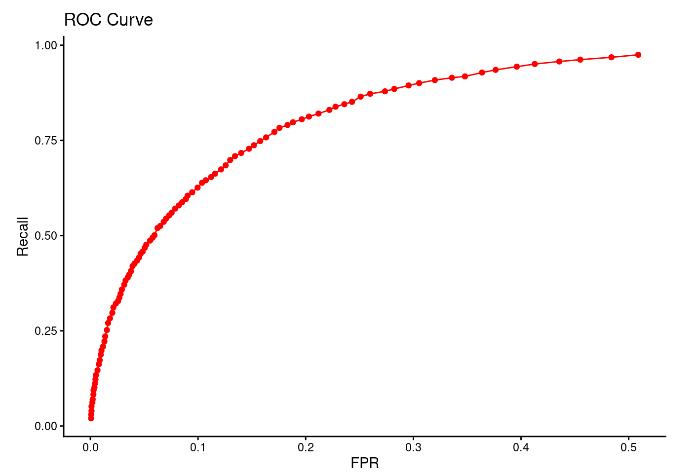
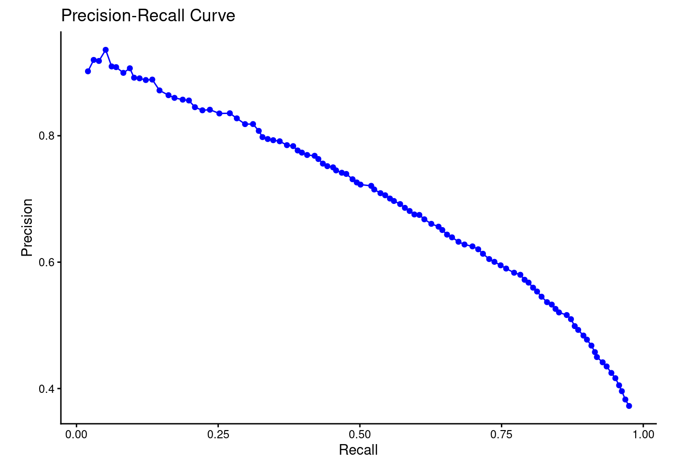

# m6APrediction: A Machine Learning Tool for Predicting m6A Modification Sites in RNA

[](https://opensource.org/licenses/MIT) 
[](https://cran.r-project.org/)

------------------------------------------------------------------------

## Overview

**m6APrediction** is an R package for predicting **N6-methyladenosine (m6A) modification sites** in RNA sequences.\
m6A is one of the most prevalent internal RNA modifications, playing key roles in gene expression regulation, RNA stability, and disease mechanisms such as cancer.

The package uses a **random forest** machine learning model trained on sequence and structural features. It achieves high accuracy, validated by ROC and PRC analyses.

------------------------------------------------------------------------

## Installation

### Using remotes

``` r
if (!require("remotes")) install.packages("remotes")
remotes::install_github("Yang-bioinfor/m6APrediction")
# Or using devtools
if (!require("devtools")) install.packages("devtools")
devtools::install_github("Yang-bioinfor/m6APrediction")
```

**Dependencies:** randomForest, stats

**R version requirement:** R ≥ 3.5.0

## Quick Start

``` r
library(m6APrediction)

#Load pre-trained model
model <- readRDS(system.file("extdata", "rf_fit.rds", package = "m6APrediction"))

#Load example input data
example_df <- read.csv(system.file("extdata", "m6A_input_example.csv", package = "m6APrediction")) 

head(example_df)
```

### Multiple-Samples Prediction

``` r
#Predict m6A modification status for multiple samples simultaneously.
results <- prediction_multiple(model, example_df, positive_threshold = 0.5)

# View DNA 5-mer, predicted probability, and status
head(results[, c("DNA_5mer", "predicted_m6A_prob", "predicted_m6A_status")])
```

## Single-Sample Prediction

``` r
single_result <- prediction_single( ml_fit = model, 
                                    gc_content = 0.45,
                                    RNA_type = "mRNA", 
                                    RNA_region = "CDS", 
                                    exon_length = 120, 
                                    distance_to_junction = 30, 
                                    evolutionary_conservation = 0.8, 
                                    DNA_5mer = "ATGCC", 
                                    positive_threshold = 0.5 )
print(single_result) 
```

## Model Performance 

<p align="center">
  
  
</p>


These plots illustrate the strong discriminative power of the **m6APrediction** random forest model.

-   The **ROC curve** (left) demonstrates a high true positive rate (TPR) at low false positive rates (FPR), indicating excellent classification sensitivity and specificity.
-   The **Precision–Recall (PRC) curve** (right) maintains high precision across a wide range of recall values, confirming the model’s robustness in handling imbalanced RNA modification data.

Overall, the model achieved:

-   **AUC (ROC)** ≈ 0.93

-   **AUPRC** ≈ 0.87

These results validate the effectiveness of sequence- and structure-based features in accurately predicting m6A modification sites.

## License

MIT and file LICENSE.

## Citation

Hongyao Yang (2025). *m6APrediction: A Machine Learning Tool for Predicting m6A Modification Sites in RNA.*

R package version 1.0.0.

<https://github.com/Yang-bioinfor/m6APrediction>
